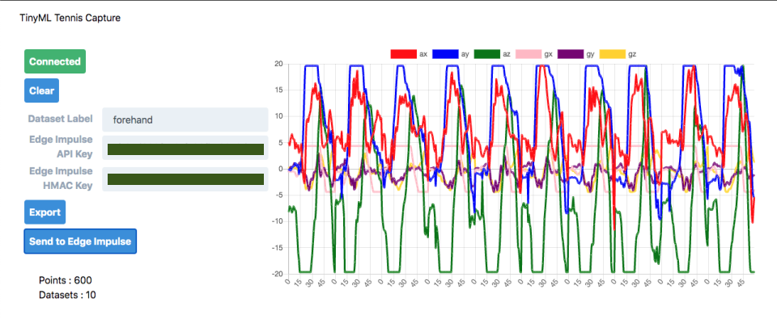

# TinyML Smart Tennis Racket

Run Machine learning on a micro controller with an accelerometer sensor to classify different moves with the racket - Forehand, Backhand, Serve and Idle.

Data is collected using the `tinyml-tennis-collector` firmware, that sends data over BLE and there is a Web UI on `web-bluetooth-bridge-ui` folder that relays the data to [Edge Impulse](https://edgeimpulse.com).

Demo video of the collecting data:

- [Link on Twitter](https://twitter.com/alvaroviebrantz/status/1318211437681135616)

The model was trained on Edge Impulse and exported to be used on the `tinyml-tennis-classifier` firmware, that them shows a different LED color depending on the class - idle (red), forehand(green), backhand(blue)

Demo video of the classification:

- [Link on Twitter](https://twitter.com/alvaroviebrantz/status/1320463069575847936)

️ ⚠️️️️**THIS IS A WORK IN PROGRESS** ⚠️

   



### TODO

- Collect more data and with different people
- Collect `Serve` data
- Make data available for others to use

## Bom - Bill of Material

- Particle Xenon and/or nRF52840 Dongle
  - I installed the [Adafruit nRF52 Bootloader](https://github.com/adafruit/Adafruit_nRF52_Bootloader)
  - I used the Particle Debugger and openocd to flash the bootloader.
- MPU 6500 Accelerometer Module

## Upload firmware with PlatformIO

I recommend installing the Visual Studio Code (VSCode) IDE and the PlatformIO plugin to get started using it. Just follow the step on the link below:

https://platformio.org/platformio-ide

To deploy to the board, just open the `tinyml-tennis-classifer` or `tinyml-tennis-collector` folder and you can use the “Build” and “Upload” buttons on PlatformIO Toolbar. All libraries and dependencies will be downloaded.

## Web Interface with Bluetooth

You need to generate an API Key/Secret pair to send data to Edge Impulse.

- Run on the command line:

```
cd web-bluetooth-bridge-ui
npm install
npm start
```

### References

- https://www.tensorflow.org/lite/microcontrollers
- https://blog.arduino.cc/2019/10/15/get-started-with-machine-learning-on-arduino/
- https://medium.com/@devdevcharlie/play-street-fighter-with-body-movements-using-arduino-and-tensorflow-js-6b0e4734e118
